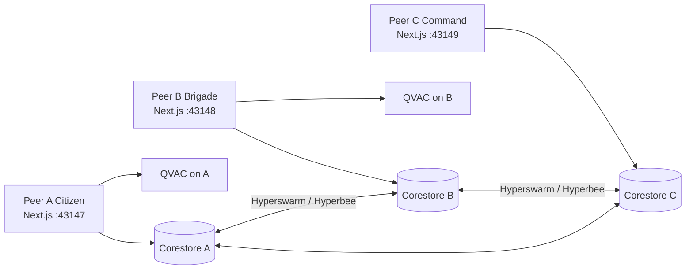
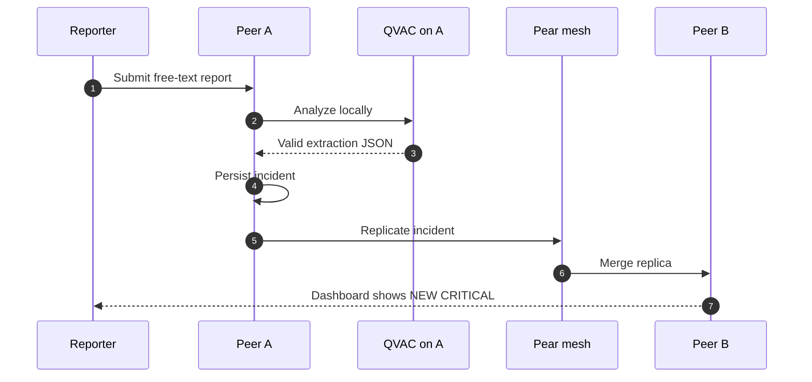

# RescueMesh Architecture

RescueMesh is a local-first mesh of Next.js processes. Each process runs QVAC on the device, keeps its own store, and replicates incidents over Pear. There is no RescueMesh coordination server.

## Quick path

1. Read the runtime topology below.
2. Follow the report flow to see where QVAC and Pear sit.
3. Use [Configuration](CONFIGURATION.md) for environment variables and [Pear](PEAR.md) for mesh behavior.

## System context



## Runtime components

| Component | Port | Responsibility | Owns secrets? |
| --- | ---: | --- | --- |
| Peer A Citizen | 43147 | Reporter UI, local QVAC, origin store | No cloud keys. Local P2P storage only. |
| Peer B Brigade | 43148 | Responder dashboard, local QVAC, replica store | Same |
| Peer C Command | 43149 | Same Responder UI, third replica store | Same |
| Demo director `/demo` | any living peer | Warmup, introduce, start/stop | Loopback-only process control |
| Browser | — | Role, localStorage incidents, dictation | No server credentials |

Each peer is a full Next.js app. Command Center is not a third product. It is a third process with the Responder role.

### QVAC

QVAC runs inside the Node process via `@qvac/sdk` (`createRequire` + `serverExternalPackages`). If the SDK is missing, returns invalid JSON, or fails warmup, the local engine still produces a schema-checked extraction.

The frontend never receives free-form model prose as the incident. See [QVAC](QVAC.md).

### Pear

Discovery, connection, and replication use Hyperswarm, Corestore, and Hyperbee. Topology is peer ↔ peer. The forbidden path is Peer → RescueMesh API → DB → Peer.

HTTP `/api/p2p/*` exists only so peers on the same laptop can introduce keys and pull replicas. That is not a central backend.

### Demo process control

`POST /api/demo/stop` exits the current Node process after 250ms. `POST /api/demo/start` spawns `npx next dev` for another peer. Both endpoints reject non-loopback hosts. See [Security](SECURITY.md).

## Request flows

### Report → incident

1. Reporter submits free text on Peer A.
2. `POST /api/qvac/analyze` runs on A.
3. QVAC SDK or local engine returns JSON.
4. Schema validation retries once, then falls back to manual review.
5. The incident is written to A's local store and published on the mesh.
6. Peer B and Peer C merge the replica and show `NEW CRITICAL INCIDENT`.



### Kill Peer A

1. Operator confirms **Stop Peer A** on `/demo` or `?demo=1`.
2. A accepts loopback `POST /api/demo/stop` and exits.
3. B still has the incident in `.p2p-data-b`.
4. Network on B marks Peer A `OFFLINE` from the HTTP probe.
5. `/demo` on B can start A again.

## Data ownership

| Data | Source of truth |
| --- | --- |
| Incident content after save | Local store of the peer that holds it, then Pear replica |
| Role and app peer id | Browser `localStorage` on that instance |
| QVAC model | On-device SDK cache for that process |
| Mesh identity | Per-process Corestore under `RESCUEMESH_P2P_STORAGE` |
| Live ONLINE/OFFLINE | HTTP probe of `:43147`–`:43149` every 1s |

There is no shared `.next` cache across demo peers. Each process uses `RESCUEMESH_NEXT_DIST`.

## Trust boundaries

- Browsers and other peers are untrusted for process control. Start/stop is loopback-only.
- No service holds an OpenAI or Anthropic key.
- CORS allows only `127.0.0.1` / `localhost` on 43147–43149.
- Diagnostics must read runtime. Empty or isolated is allowed. Hardcoded “connected” is not.

## Repository map

```text
app/            Next.js App Router, API routes
components/     Reporter, responder, demo UI
domain/         Incident model, priority, dedup
qvac/           Prompts, schema, SDK load, local engine
p2p/            Pear host, merge, diagnostics
lib/            Session, demo director, local peer probe
docs/           Maintainer and user documentation
tests/          Playwright smoke, e2e, 7-step demo
```

## Related documents

- [Getting started](GETTING_STARTED.md)
- [Configuration](CONFIGURATION.md)
- [QVAC](QVAC.md)
- [Pear](PEAR.md)
- [Operations](OPERATIONS.md)
- [Testing](TESTING.md)
- [Security](SECURITY.md)
- [Product specification](PRODUCT.md)
